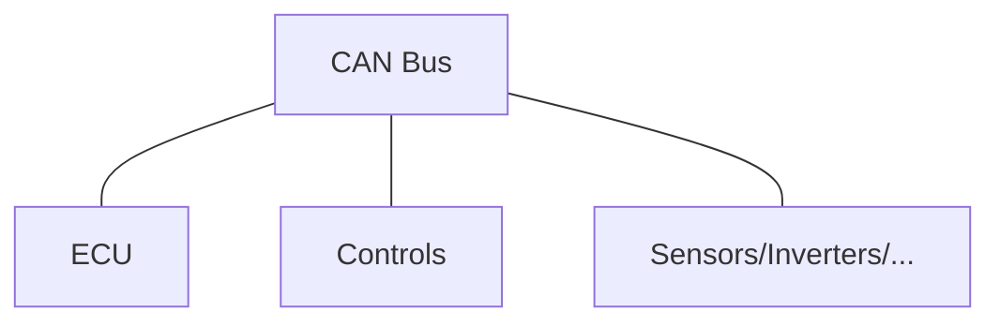
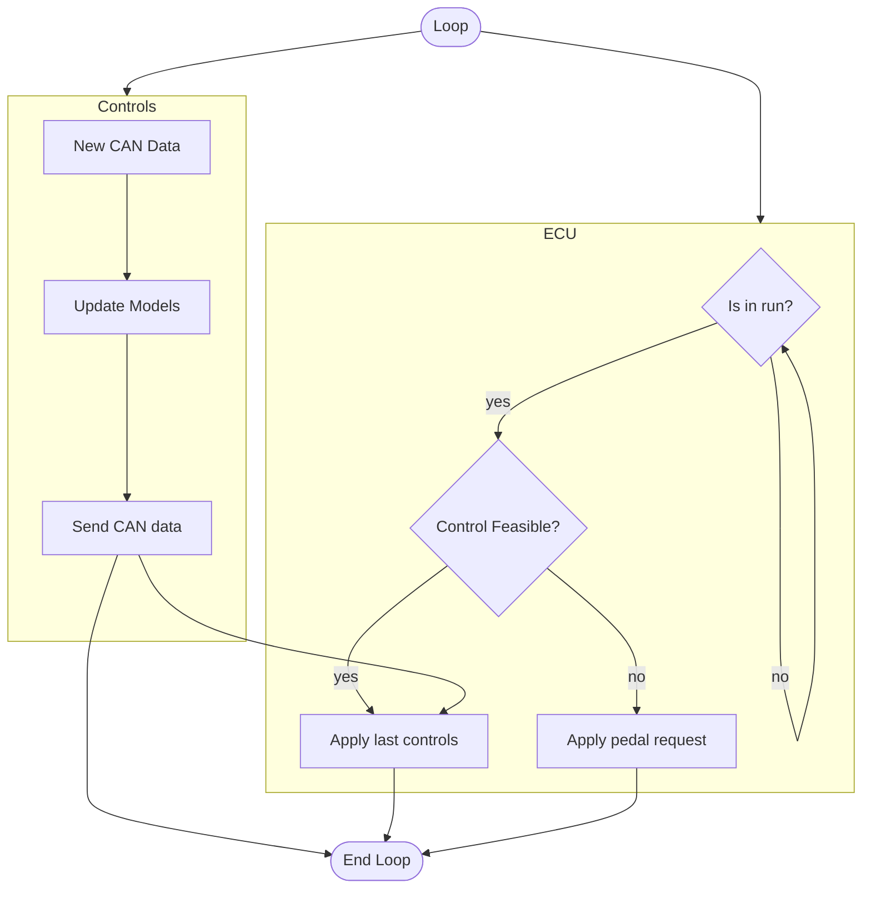

# Architecture
How does the traction control work in fenice EVO?

We have an ECU that implements all the safety features required from the competition rules and it is resposible to send the torque requests to the inverters and so to the motors.  
Without controls, the torque is mapped with the accelerator pedal and scaled by the power map that is a percentace on the full available power (80 kW).  
With controls it will need to receive the rear torques from the traction control. How does this work?

This is the general connection of the devices involved in the traction control loop.  
ECU, Controls and all the other devices communicate directly in CAN bus, both controls and ECU are receiving the same data simultaneously.  
The torques calculated from the controls will be sent to the ECU again in CAN bus.

In this flowchart it is represented in high level the logic behind the controls actuation.

### Are controls feasible?
This is a check done on the ECU, this is done checking:
- Control is alive? Is the ECU receiving Control messages? This checks for the last message received and if it elapsed more than 3 times the send delay of the message, then the control is not anymore connected. Ex: send every 100ms, if the last message was received more than 300ms then the check is not passed.
- Control has the same configurations? Check if power map, traction control map and slip control map are the same. This is done to be sure that the control is seeing the same maps as the ECU.

If these checks are not passed then the ECU will use the torques calculated based on the accelerator pedal position.
